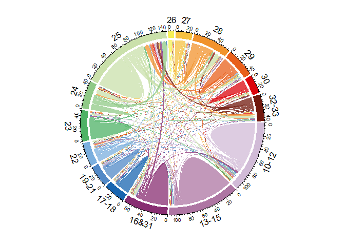

Chord Diagrams
================
Liliana Cuccu
March 2022

This script reports the code used to produce two plots included in the
academic paper “Just Reallocated? Robots, Displacement, and Job
Quality”, authored by Liliana Cuccu and Vicente Royuela (available
[here](https://www.ifo.de/sites/default/files/events/2022/pillars22-Cuccu.pdf)).

The plots are Chord diagrams representing workers’ transitions across
economic sectors (Nace Rev.2) after a layoff. Worker-level information
is taken from the Muestra continua de vidas laborales (MCVL), an
anonymised panel extracted from the Spanish Social Security records,
covering the period 2001-2019. The dataset comprises 4% of the reference
population, roughly amounting to one million individuals, and provides a
detailed set of characteristics for each of their work or unemployment
spells, such as start and termination date, cause of contract
termination, province of work, economic sector, earnings, contract type,
and number of workers employed in the same firm.

The first chord diagram refers to transitions within the 1-digit sector
“C - Manufacturing”, while the second diagram reports transitions across
(aggregated) 1-digit sectors. In both diagrams flows are reported in
hundreds of transitions and only include workers estimation sample
described in the paper. The 2-digit manufacturing sectors are: “10-12 -
Food and beverages”, “13-15 - Textiles”, “16&31 - Wood and Furniture”,
“17-18 - Paper”, “19-21 - Refined petroleum, chemical and pharmaceutical
products”, “22 - Rubber”, “23 - Non-metallic mineral products”, “24 -
Basic metals”, “25 - Metal products”, “26 - Computer, electronic and
optical products”, “27 - Electrical equipment”, “28 - machinery and
equipment n.e.c.”, “29 - Motor vehicles, trailers and semi-trailers”,
“30 - Other transport equipment”, “32-33 - Other manufacturing, repair
and installation”. The (aggregated) 1-digit sectors: “A-B - Agriculture
and mining”, “C - Manufacturing”, “D-E - Energy, water and waste”, “F -
Construction”, “G - Wholesale and retail trade; repair of motor
vehicles”, “H - Transporting and storage”, “I - Accommodation and food”,
“J - Information and communication”, “K - Finance and insurance”, “L -
Real estate”, “M - Professional, scientific and technical activities”,
“N - Administrative and support services”, “O-Q - Public administration
and defence, compulsory social security, education and social work”,
“R-U - Arts, entertainment and other services”.

``` r
# Libraries
library("readxl")
library("tidyr")
library("tidyverse")
library("circlize")
```

## 1. Transitions within Manufacturing

``` r
# Clean environment
rm(list=ls())

  #  Import the data
  data <- read_excel("01_Data/Transit_ManToMan.xlsx", sheet = "Sheet1" , range = "B1:P16")
  
  #  Fix sector codes (symmetric matrix: use column names to assign row names)
  rownames(data) <- colnames(data)
  
  # Define color palette
  mycolor5 <- c("#D1BBD7", "#AE76A3", "#882E72", "#1965B0", "#5289C7", "#7BAFDE", "#4EB265" ,
                "#90C987", "#CAE0AB", "#F7F056", "#F6C141", "#F1932D", "#E8601C", "#DC050C", "#72190E" )
  
  # Turn data into a matrix 
  mat <- data.matrix(data, rownames.force = NA)
  
  # Base plot
  par(cex = 1.3) # font size

  chordDiagram(
    mat,                                   # use data we stored in matrix "mat"
    grid.col= mycolor5,                    # use colors we stored in "mycolor5"
    transparency = 0.25,                   # set transparency level of colors
    directional = 1,                       # directional with value 1 means the direction is from rows to columns
    direction.type = c("arrows"),          # style of the links (use arrows to represent directions)
    link.arr.type = "big.arrow",           # type of arrows
    diffHeight  = -0.04,                   # height difference of the two ends of links
    annotationTrackHeight = c(0.07, 0.07), # distance between outer labels and inner labels
    link.sort = TRUE,                      # sorting links according to the width on the sector
    link.largest.ontop = TRUE,             # control the order of positioning links on sectors
    self.link = 1)                         # show also transitions to same sector
```

<!-- -->

## 2. Transitions across 1-digit sectors

``` r
  #  Import the data
  data <- read_excel("01_Data/Transit_ManToNonMan.xlsx", sheet = "Sheet1" , range = "A1:O16")
  
  # Fix sector codes (symmetric matrix: use column names to assign row names)
  rownames(data) <- colnames(data)

  # get colors
  mycolor5 <- c("#D1BBD7", "#AE76A3", "#882E72", "#1965B0", "#5289C7", "#7BAFDE", "#4EB265" ,
                "#90C987", "#CAE0AB", "#F7F056", "#F6C141", "#F1932D", "#E8601C", "#DC050C", "#72190E" )
  
  # matrix 
  mat <- data.matrix(data, rownames.force = NA)
  
  # Base plot
  par(cex = 1.3) # font size

  chordDiagram(
    mat,                                   # use data we stored in matrix "mat"
    grid.col= mycolor5,                    # use colors we stored in "mycolor5"
    transparency = 0.25,                   # set transparency level of colors
    directional = 1,                       # directional with value 1 means the direction is from rows to columns
    direction.type = c("arrows"),          # style of the links (use arrows to represent directions)
    link.arr.type = "big.arrow",           # type of arrows
    diffHeight  = -0.04,                   # height difference of the two ends of links
    annotationTrackHeight = c(0.07, 0.07), # distance between outer labels and inner labels
    link.sort = TRUE,                      # sorting links according to the width on the sector
    link.largest.ontop = TRUE,             # control the order of positioning links on sectors
    self.link = 1)                         # show also transitions to same sector
```

<!-- -->
