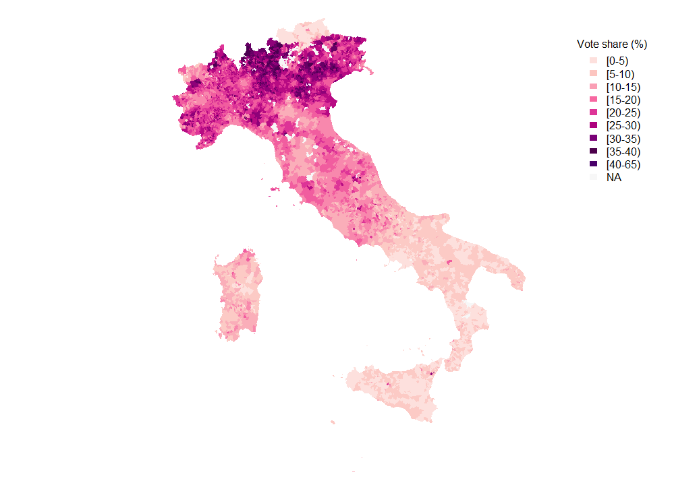

Choropleth map
================
Liliana Cuccu
October 2022

This script reports the code used to produce one plot included in the
academic paper “Logistic Hubs and Support for Radical-right Populism:
Evidence from Italy”, authored by Liliana Cuccu and Nicola Pontarollo.

The plot is a choropleth map representing Lega’s vote share in 2018
elections for the Italian Parliament (Chamber of Deputies). Official
voting results at the municipal level are released by the Italian
Ministry of Interior affairs ( data can be downloaded
[here](https://elezionistorico.interno.gov.it/)).

``` r
# clean the environment
rm(list=ls())

# libraries
library(openxlsx)
library(sf)
library(tidyverse)
library(ggspatial)
library(ggplot2)
library(rgdal) 
library(broom) 
library(wesanderson)
library(viridis)
library(RColorBrewer)
library(haven)
library(dplyr)
library(arules)
```

``` r
# import file with electoral results by municipality
df<-read.csv("01_Data/VariablesForMap_static.csv")

# import shapefile of Italian municipalities
sf_regional <- readOGR("01_Data/Limiti01012018_g/Com01012018_g/Com01012018_g_WGS84.shp")

# merge catasto codes 
Crosswalk_Catasto_Istat_2004_2020 <- read_dta("01_Data/Crosswalk_Catasto_Istat_2004_2020.dta")
df_italy<-merge(df,Crosswalk_Catasto_Istat_2004_2020)

names(sf_regional)[names(sf_regional)=="PRO_COM_T"]<-"istat_code"
italy_regions<-merge(sf_regional,Crosswalk_Catasto_Istat_2004_2020,by="istat_code")
writeOGR(italy_regions, dsn = '01_Data', layer = 'poly1', driver = "ESRI Shapefile",overwrite_layer = T)

# read in shapefile as st for ggplot to work
a<-st_read("01_Data/poly1.shp")

# fortify by region to create dataframe which you can use to merge, contains a geometry column
a_fortified<-fortify(a,region="cat_code")

# simplified shapefile
sf_regional1 <- readOGR("01_Data/poly1.shp") 
```

``` r
# define colors and breaks
labels<- c("[0-5)","[5-10)","[10-15)","[15-20)","[20-25)","[25-30)","[30-35)","[35-40)","[40-65)", "NA")
filling<- c('#fde0dd','#fcc5c0','#fa9fb5','#f768a1','#dd3497','#ae017e','#7a0177','#4d004b','#49006a','#f7f7f7')
pal<-colorRampPalette(c('#fde0dd','#fcc5c0','#fa9fb5','#f768a1','#dd3497','#ae017e','#7a0177','#4d004b','#49006a'))
    

yr<-2018
temp <- data.frame(df$cat_code, df$year ,df$sh_vot_LN)
italy_df <- subset(temp, subset = df.year==yr)
italy_df <- italy_df %>% 
  rename(
    year = df.year,
    cat_code= df.cat_code,
    sh_vot_LN=df.sh_vot_LN
  )
    
sf_regional2<-merge(sf_regional1,italy_df,by=c("cat_code"))   # merge variable to plot to the shapefile
palette_bins <- c(0,5,10,15,20,25,30,35,40,45,100)   # define bins
sf_regional2$bin<-cut( sf_regional2$sh_vot_LN, breaks=palette_bins,dig.lab = 5) # split variable in bins
sf_regional2$col<-pal(11)[as.numeric(cut(sf_regional2$sh_vot_LN,
                                         c(0,5,10,15,20,25,30,35,40,45,100)))] # assign colors to bins
sf_regional2$col<-ifelse(is.na(sf_regional2$col),'#f7f7f7',sf_regional2$col)  #set NA red

# plot
par(mar = c(0, 0, 0, 0))
plot(sf_regional2,col=sf_regional2$col,border=FALSE)
legend("topright",inset=0.07,title = "Vote share (%)",
       fill=filling,col=filling,legend = labels,cex=1,
       border = "white", box.lty=0, box.lwd=0, box.col="white" )
```

<!-- -->
