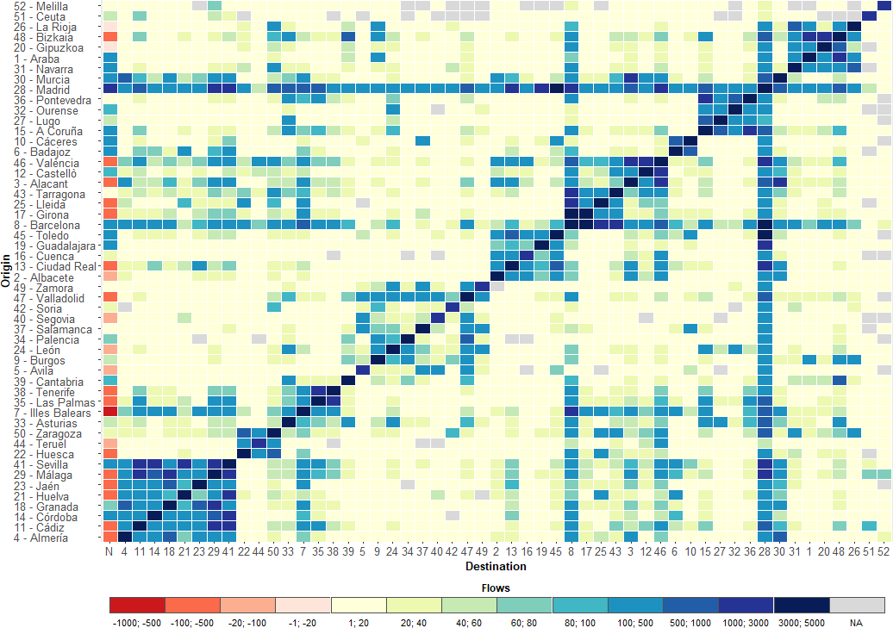

Heat map
================
Liliana Cuccu
March 2022

This script reports the code used to produce one plot included in the
academic paper “Just Reallocated? Robots, Displacement, and Job
Quality”, authored by Liliana Cuccu and Vicente Royuela (available
[here](https://www.ifo.de/sites/default/files/events/2022/pillars22-Cuccu.pdf)).

The plot is a heat map representing workers’ migration flows between
Spanish provinces after a lay-off. Worker-level information is taken
from the Muestra continua de vidas laborales (MCVL), an anonymised panel
extracted from the Spanish Social Security records, covering the period
2001-2019. The dataset comprises 4% of the reference population, roughly
amounting to one million individuals, and provides a detailed set of
characteristics for each of their work or unemployment spells, such as
start and termination date, cause of contract termination, province of
work, economic sector, earnings, contract type, and number of workers
employed in the same firm.Provinces in the y-axis represent the province
of origin (i.e., the province in which the worker was employed before
being laid off) while provinces in the x-axis represent the destination
provinces (i.e., the province in which the worker starts a new job). The
flows are reported in hundreds of transitions and only include workers
estimation sample described in the paper. For each row, column “N”
reports the net inflows by province.

``` r
# Clean environment
rm(list=ls())

# Libraries
library(gplots)
library(openxlsx)
library(sf)
library(tidyverse)
library(ggspatial)
library(ggplot2)
library(rgdal) 
library(broom) 
library(wesanderson)
library(viridis)
library(RColorBrewer)
library(arules)
library(dplyr)
library(readxl)
```

``` r
# Import data
data <- read_excel("01_Data/Transit_ByProvince_long.xlsx", sheet = "Sheet1" , col_names=TRUE)

# Define order 
lev <-  unique(as.vector(data$orig))
data <- mutate(data, orig2=factor(orig, levels = lev))

lev <-  unique(as.vector(data$dest))
data <- mutate(data, dest2=factor(dest, levels = lev))

# discrete variable
data$p2 <- discretize( data$p, method="fixed", 
                       breaks = c(-1000,-500,-100,-20,0,20,40,60,80,100,500,1000,3000, 
                                  max(data$p[!is.na(data$p)])),
                       labels = c("-1000; -500","-100; -500","-20; -100","-1; -20", "1; 20", 
                                "20; 40", "40; 60","60; 80","80; 100",
                                "100; 500","500; 1000","1000; 3000","3000; 5000"))
```

``` r
# basic ggplot
par(omi=c(0,0,0,0), mgp=c(0,0,0),mar=c(0,0,0,0)) # margins

pl <- ggplot(
  data,aes(x=dest2,y=orig2,fill=p2)) +
  geom_tile() +
  geom_tile(colour="white",size=0.25)+
  # remove extra space
  scale_y_discrete(expand=c(0,0))+
  # set a base size for all fonts
  theme_grey(base_size=8) +
  # theme options
  theme(
    # set thickness of axis ticks
    axis.ticks=element_line(size=0.4),
    # size axis labels and legend
    axis.text=element_text(size=9.5),
    legend.text=element_text(size=8),
    # size axes titles
    axis.title=element_text(size=10,face="bold", line=8), 
    # remove plot border
    panel.border=element_blank(),
    legend.position="bottom", legend.box = "horizontal", 
    # space between legend and plot
    legend.margin=margin(0,0,0,0),
    # no white margins
    plot.margin=grid::unit(c(0,0,0,0), "mm"),
    # legend style
    legend.key.height= unit(5, 'mm'),
    legend.key.width= unit(17, 'mm'),
    legend.spacing.x = unit(0, 'mm'),
    legend.title.align=0.5,
    legend.title = element_text(size=9, face="bold"),
    # left-align y labels
    axis.text.y = element_text(hjust = 0) ) +
  theme(legend.position = "bottom") +
  
  # axis titles
  labs(y='Origin',x='Destination') +
  # color scale
  geom_polygon(aes(fill=p2), color = "#525252", size = 0.1)+
  scale_fill_manual(values=c('#cb181d','#fb6a4a' ,'#fcae91','#fee5d9',
                             '#ffffd9','#edf8b1','#c7e9b4','#7fcdbb',
                             '#41b6c4','#1d91c0','#225ea8','#253494','#081d58'), na.value="#d9d9d9") +
  guides(fill=guide_legend(title="Flows", label=TRUE, 
         label.position = "bottom", nrow = 1, title.position = "top"))

pl
```

<!-- -->
